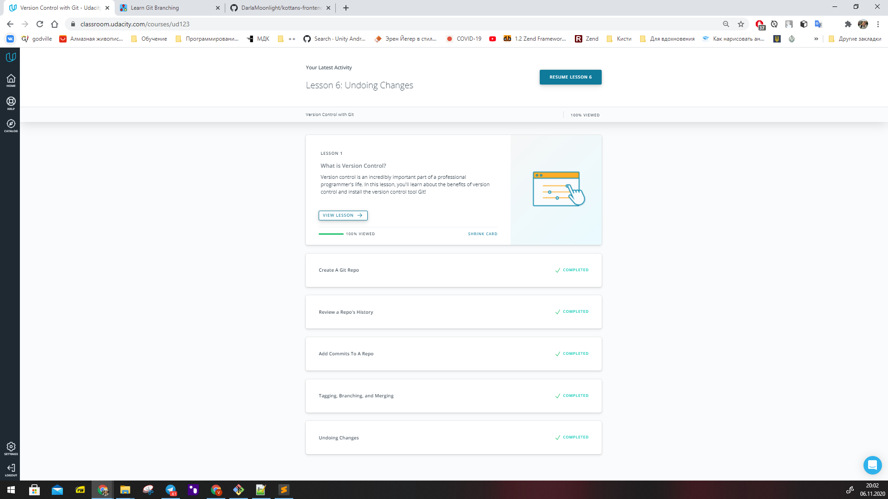
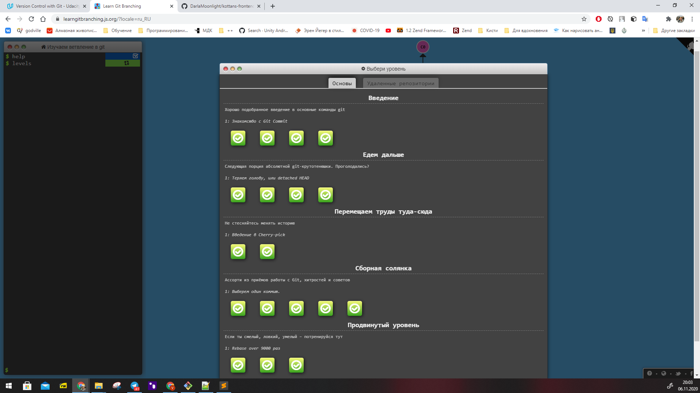
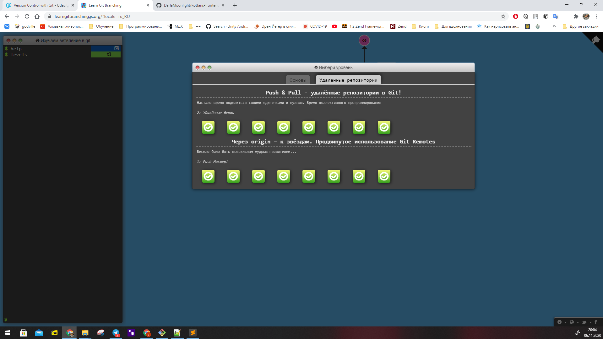
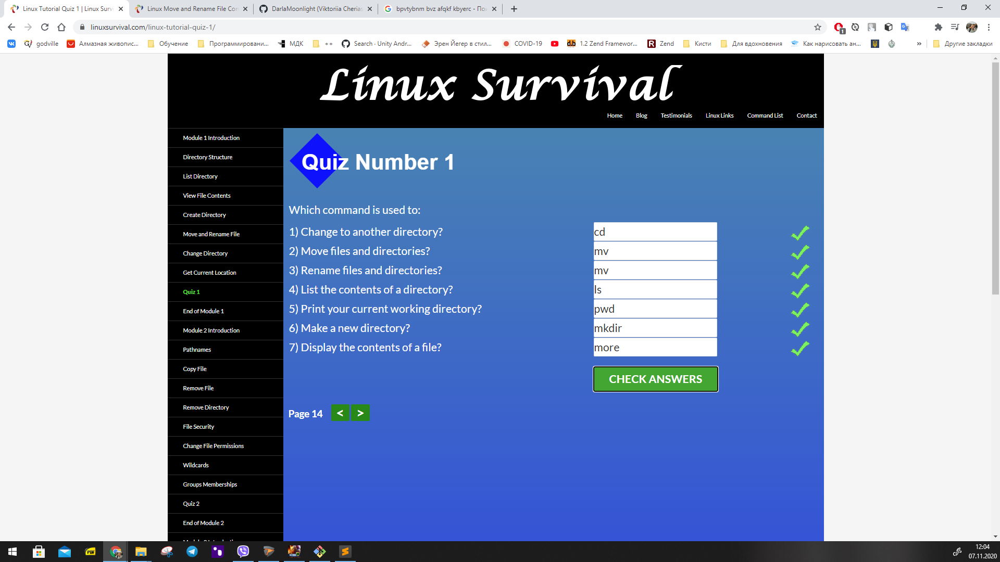
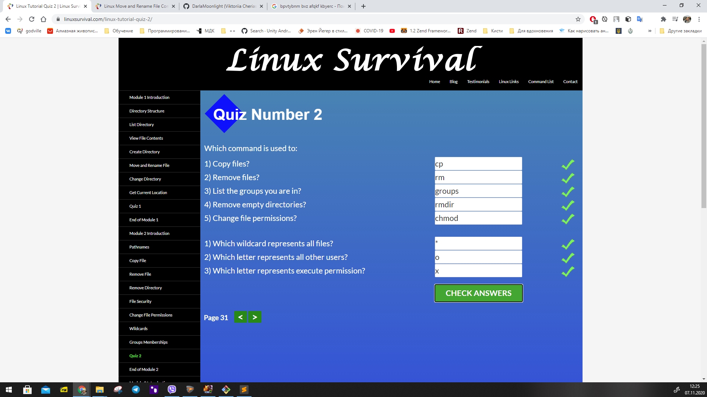
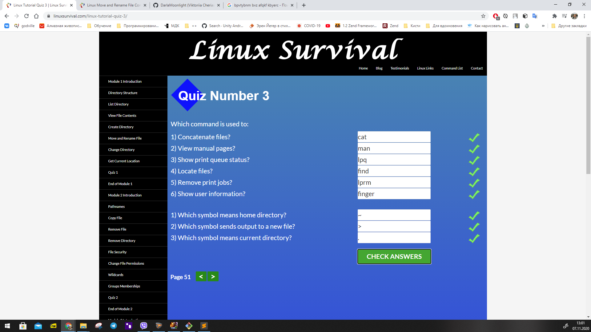
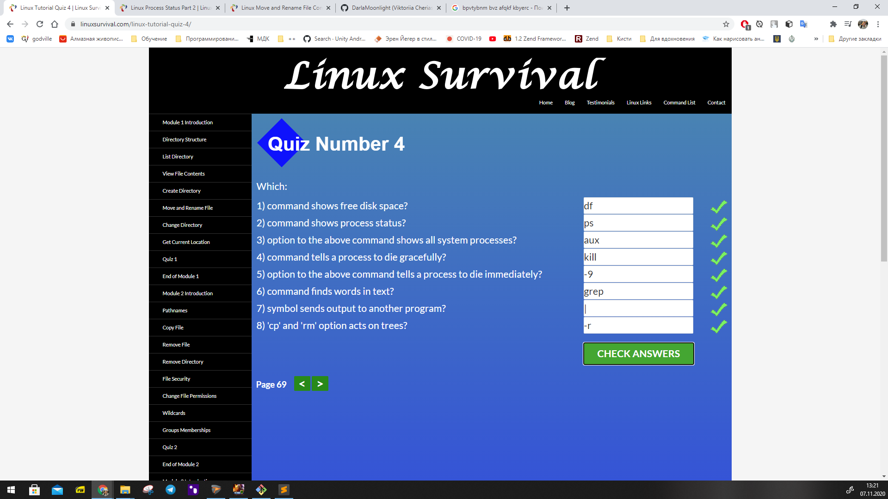
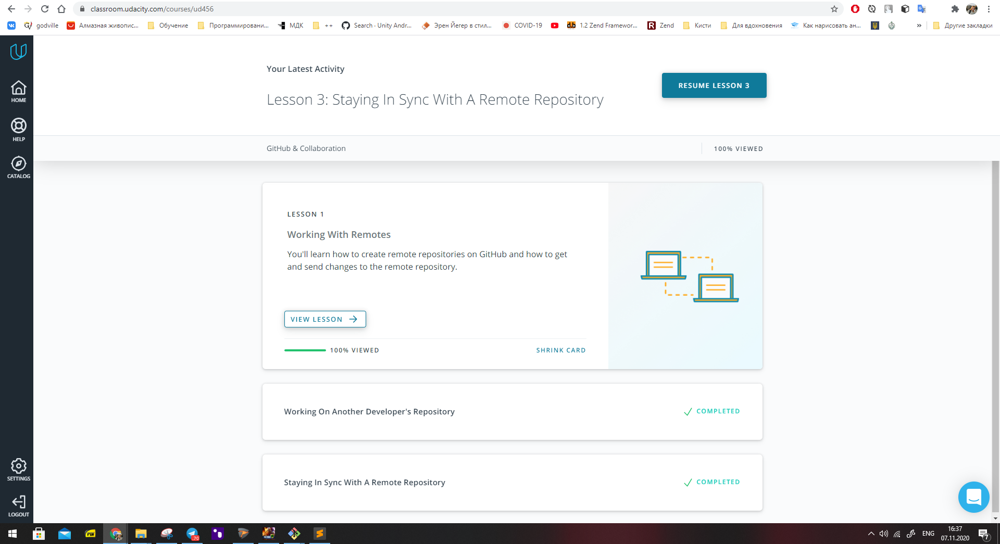

# kottans-frontend

---

## Curriculum:

**General**
- [x] **0.** [Git Basics](#git-basics)
    - Course: Version Control with Git (Udasity)
    - Course: Learn Git branching
- [x] **1.** [Linux CLI and Networking](#linux-cli-and-http)
    - Course: Linux Survival
    - Article: HTTP: The Protocol Every Web Developer Must Know - Part 1
    - Article: HTTP: The Protocol Every Web Developer Must Know - Part 2
- [x] **2.** [VCS (hello gitty), GitHub and Collaboration](#git-collaboration)
    - Course: GitHub & Collaboration
    - Course: Learn Git branching (last levels)

**Front-End Basics**
- [ ] **3.** Intro to HTML & CSS
    - Course: Intro to HTML & CSS (Udasity)
    - Course: Learn HTML(Codeacademy)
    - Course: Learn CSS(Codeacademy)
- [ ] **4.** [Responsive Web Design]()
    - Course: Responsive Web Design Fundamentals
    - Game: Flexbox froggy
- [ ] **5.** [HTML & CSS **Practice**]()
- [ ] **6.** [JavaScript Basics]()
- [ ] **7.** [Document Object Model]() - practice

**Advanced Topics**
- [ ] **8.** [Building a Tiny JS World (pre-OOP)]() - practice
- [ ] **9.** [Object oriented JS]() - practice
- [ ] **10.** [OOP exercise]() - practice
- [ ] **11.** [Offline Web Applications]()
- [ ] **12.** [Memory pair game]() — real project!
- [ ] **13.** [Website Performance Optimization]()
- [ ] **14.** [Friends App]() - real project!

---

## General

---

### Git Basics

#### Version Control with Git
The Udacity course provides basic knowledge and understanding of how git works, which is very useful for those who have not worked with version control systems.
I really liked how the visualization of the git commands was done.

Screenshot

#### Learn Git branching interactive course
From this course I learned new comand "cherry-pick" and had a lot of fun solving their puzzles.

Screenshot1

Screenshot2

#### Results

Working with git is nothing new to me. But it was interesting to repeat some of his commands that I don't often use in my work. Unfortunately for me, working with git worktree was not mentioned in these courses.

---

### Linux CLI and HTTP

#### Linux Survival

As a user of the Windows system, I was very interested to learn more about Linux. Many of the commands mentioned in the course can be helpful when using git bash.

Screenshot1

Screenshot2

Screenshot3

Screenshot4

#### HTTP: The Protocol Every Web Developer Must Know - Part 1 & Part 2

These articles make it clear what the HTTP protocol is. Much of the information presented needs to be read thoughtfully and several times.
The articles are very informative and do not immediately fit into my head, so I think I will return to them at least twice more for a more detailed understanding.

---

### Git Collaboration

#### Course: GitHub & Collaboration

This course is a follow-up to Version Control with Git. In it, we will learn more detailed work with a remote repository and good practices of cooperation with other free software developers.
I don’t use 'pull requests' on a daily basis, so this topic was very interesting to me.

Screenshot

#### Course: Learn Git branching (last levels)

I finished this course with an assignment [Learn Git branching interactive course](#learn-git-branching-interactive-course)
