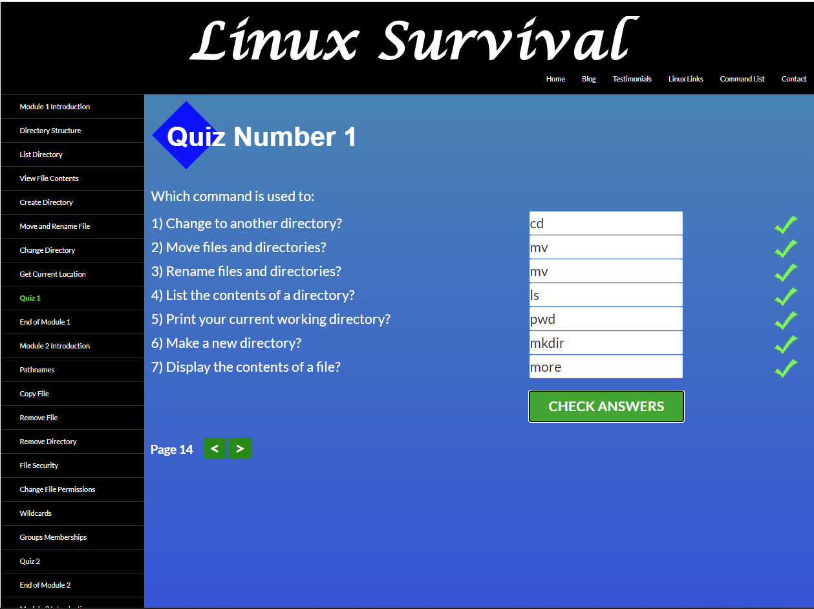
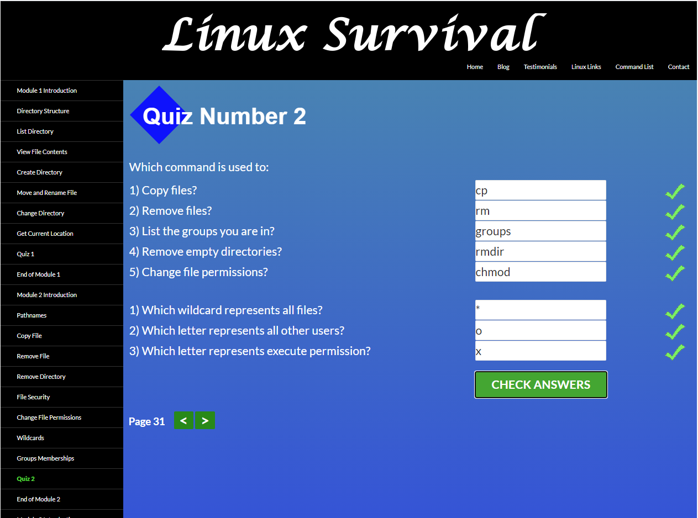
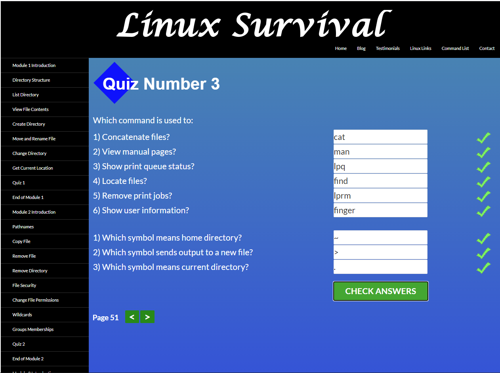
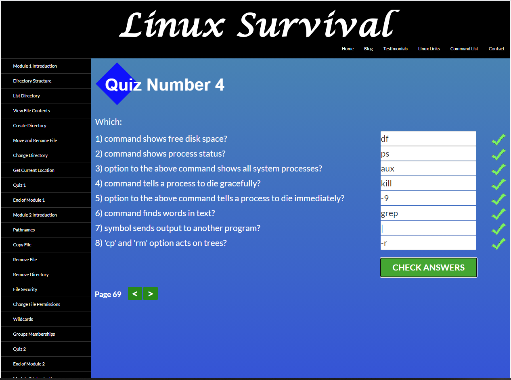

# kottans-frontend
---

## Curriculum:

**General**
- [x] **0.** [Git Basics](#git-basics)
    - Course: Introduction to Git and GitHub (Coursera 1-2 weeks)
    - Course: Learn Git branching
- [x] **1.** [Linux CLI and Networking](#linux-cli-and-http)
    - Course: Linux Survival
    - Article: HTTP: The Protocol Every Web Developer Must Know - Part 1
    - Article: HTTP: The Protocol Every Web Developer Must Know - Part 2
- [ ] **2.** [VCS (hello gitty), GitHub and Collaboration](#git-collaboration)
    - Course: Introduction to Git and GitHub (Coursera 3-4 weeks)
    - Course: Learn Git branching (last levels)

**Front-End Basics**
- [ ] **3.** [Intro to HTML & CSS]()
- [ ] **4.** [Responsive Web Design]()
- [ ] **5.** [HTML & CSS Practice]()
- [ ] **6.** [JavaScript Basics]()
- [ ] **7.** [Document Object Model]() - practice

**Advanced Topics**
- [ ] **8.** [Building a Tiny JS World (pre-OOP)]() - practice
- [ ] **9.** [Object oriented JS]() - practice
- [ ] **10.** [OOP exercise]() - practice
- [ ] **11.** [Offline Web Applications]()
- [ ] **12.** [Memory pair game]() — real project!
- [ ] **13.** [Website Performance Optimization]()
- [ ] **14.** [Friends App]() - real project!

---

## General

---

### Git Basics

#### Introduction to Git and GitHub
The Coursera course provides basic knowledge and understanding of how git works, which is very useful for those who have not worked with version control systems.
I really liked how the visualization of the git commands was done.

Screenshot

Screenshot

#### Learn Git branching interactive course

Screenshot1

Screenshot2

#### Results

Working with git is nothing new to me. But it was interesting to repeat some of his commands that I don't often use in my work. Unfortunately for me, working with git worktree was not mentioned in these courses.

---

### Linux CLI and HTTP

#### Linux Survival

As a user of the Windows system, I was very interested to learn more about Linux. Many of the commands mentioned in the course can be helpful when using git bash.

Screenshot1

Screenshot2

Screenshot3

Screenshot4

#### HTTP: The Protocol Every Web Developer Must Know - Part 1 & Part 2

These articles make it clear what the HTTP protocol is. Much of the information presented needs to be read thoughtfully and several times.
The articles are very informative and do not immediately fit into my head, so I think I will return to them at least twice more for a more detailed understanding.

